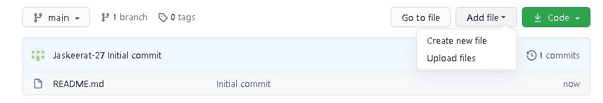

# Learn to Host your Resume on GitHub Pages using some great Modern technical writing principles and tools
In this README you can find a tutorial on How to host your Resume on GitHub pages. We will refer to Andrew Etters' book, [Modern Technical Writing: An Introduction to Software Documentation](https://www.amazon.ca/Modern-Technical-Writing-Introduction-Documentation-ebook/dp/B01A2QL9SS) and discuss some great principles of modern technical writing. Additionally we will also discuss some great documentation tools.

## Prerequisites

- **Resume(formatted in Markdown)** - You can use this [Online Markdown Editor - Pandao](https://pandao.github.io/editor.md/en.html) to format your Resume in Markdown format and you can also refer to this [Markdown guide](https://www.markdownguide.org/basic-syntax#blockquotes-with-other-elements) for a great markdown tutorial.
- **GitHub Account** - You can click [here](https://github.com/join) and create a free account on GitHub. You can also use the GitHub desktop version. You will need a GitHub pro account if you wish to keep your repository private or you can keep your repository public in a free account and host your website.

## Audience

This step-by-step tutorial will help Computer Science students host their resume in markdown format on GitHub Pages for free. We will also discuss some great principles of modern technical writing mentioned in Andrew Etters's book and learn how to edit their resume on the static website, so there is no duplication. 

# Host your Resume on GitHub Pages

Now we will see go through the steps involved in hosting our resume on GitHub Pages. We will also discuss the key principles and tools we used to format and host our resume on a static website. 

## Instructions

**1. Login to your GitHub account.**

- You can login to your GitHub account using this [link](https://github.com/login).
- If you want to create a new account you can use this [link](https://github.com/join?source=login).

**2. Create a new Repository.**

- Once you have logged in to your GitHub account, you can navigate to the top right corner to a '+' sign. You can click it to access the dropdown menu.
- To create a new repository you can select `New Repository` from the dropdown menu.
- Now we need to provide a `Repository name` and we can also provide some brief description about the repository.
- We need to set the repository to `Public` in order to host our resume on a free GitHub account(a GitHub pro account is required to host a `Private` repository online)
- Lastly, we can choose to add a README file, which will be automatically created by GitHub in your main directory once you hit `Create Repository` at the bottom of the page.

>Insert pic/GIF

**3. Add your Markdown formatted Resume in the Repository.**

- Once you have created a new repository, you can click on the `Add file` and from the dropdown menu you can either `Create a new file`(use the online markdown editor by GitHub to format the resume online) or you can choose `Upload files'(to upload a markdown formatted .md file).
- Once you choose `Upload files`, you will be directed to a page where you can upload the resume and the `Commit directly to the main branch` option will be selected by default.
- Now we can click on `Commit changes `and our resume.md will be uploaded in the main branch and we will be redirected to the repository page.
- Now we need to rename the resume.md file to `index.md` in order to host it on the GitHub Pages. To do this, we will need to click on the `resume.md` and once opens, we can choose the `Edit this file` option(we can also edit the document online by selecting this option). Now you will be able to change the name to `index.md` and press `Commit Changes` to successfully update the file name.
 
>Insert pic

**4. Host the Resume online and apply themes**

- Once you have renamed the resume file to `index.md`. Now we can go to the `Settings` tab.
- Once we are in the Settings tab, we will scroll down to the `GitHub Pages` section and for `Source` we will select `main` from the drop-down menu and hit `Save`.
- Once you hit Save, the resume or index.md file will be hosted online by GitHub Pages. To find the link to the online website generated, we can scroll down again to the `GitHub Pages` section and now we will be able to see the link for the page.
- If you click on the link, you will be directed to the hosted page.
- To apply themes to the document. Go to the `Settings` tab and scroll down to `GitHub Pages` section and click on `Choose a theme`, you will be redirected to a theme selection page where themes are displayed and we can simply go through the list and choose the desired theme by clicking on the `Select theme` and then `Commit changes` to successfully save the theme change.
- Now to view the change, we can go to our `Settings` tab and click on the repository link again and check(sometimes we have to wait some time for the changes to actually occur on the hosted website).

## Key principles of Modern Technical Writing

Documentation are simple. They don't need a ton of dependencies. They should be fast, portable and accessible to anyone. Static sites are exactly that. That is why they are great for documentation. They can be hosted almost anywhere. No extensive installation, databases nor large-scale software needed to make one.

 ***Lightweight Markup Language***

- The syntax for a light markup language is simple and easy to learn. We have formatted our resume in Markdown for hosting on Github, which is the most popular lightweight markup language. 

***Format a document using a Static Website Generator*** 

- Static website generator is what makes the job easy. Provide it with content (lightweight markup file) and a theme (HTML & CSS), and _viola_ it formats into a working website. Maintaining your site becomes effortless making your document in sync with the world in no time.

- `Jekyll` is the generator that Github Pages provides to process static websites. There are 3 ways you can work with Jekyll: [by modifiying settings](https://guides.github.com/features/pages/), forking a theme, or [starting from scratch](https://www.chrisanthropic.com/blog/2016/creating-gem-based-themes-for-jekyll/). Forking a theme was done for this project.

***Host documentson on a distributed version control system***

  - Distributed Version Control has many advantages: it is much more efficient and allows us to work offline. It is also better when many changes are made concurrently on the same file and it also keeps a record of the development. While hosting our resume, we are storing the Readme file in the same folder as the resume file which helps keeping the documentation and code branches in sync. This also ensure that only one documentation is maintained and no there are no duplicates.

## More Resources

- [Modern Technical Writing: An Introduction to Software Documentation by Andrew Etter](https://www.amazon.ca/Modern-Technical-Writing-Introduction-Documentation-ebook/dp/B01A2QL9SS)
- [Online Markdown Editor - Pandao](https://pandao.github.io/editor.md/en.html) 
- [Markdown guide](https://www.markdownguide.org/basic-syntax#blockquotes-with-other-elements)
- [Markdown Editor - Typora](https://typora.io/)

## Authors and Acknowledgments

- **Readme Author:** Jaskeerat Singh ([@jaskeerat-27](https://jaskeerat-27.github.io/Jaskeerat/))
- **Time Machine Theme Author:** Parker Moore ([@parkr](https://github.com/parkr))

## FAQs

#### 1. Why is Markdown better than a word processor?

- Markdown is a simple formatting language and since it is a widely used language, it is a safe option to fromat our documentation in Markdown. We can edit a markdown document anytime using any online/offline markdown editor and the document processing is fast since it contains just plain text. Markdown languge also has a shallow learing curve. on the other had, word documents(.docx) can only be edited in certain softwares like Micresoft Word, and Microsoft Word's HTML export is not suitable for creating websites or documentation. 

#### 2. Why is my resume not showing up?

- Check if the GitHub Page source is set to main branch. Go to `Settings` tab, then scroll down to `GitHub Pages` section and set the source to `main` from the drop down-menu.
- Check if the name of the file to be hosted is `index.md`('index' should be all lower-case letters), if the file name is incorrect the GitHub Pages will not host the document.
- Sometime GitHub takes some time to host the document or update changes. Wait for some time and try to refresh the page, if it still does not work try to cleat the cache and cookies from your browser and try again.
